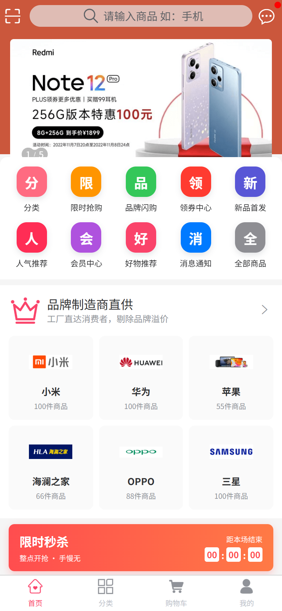
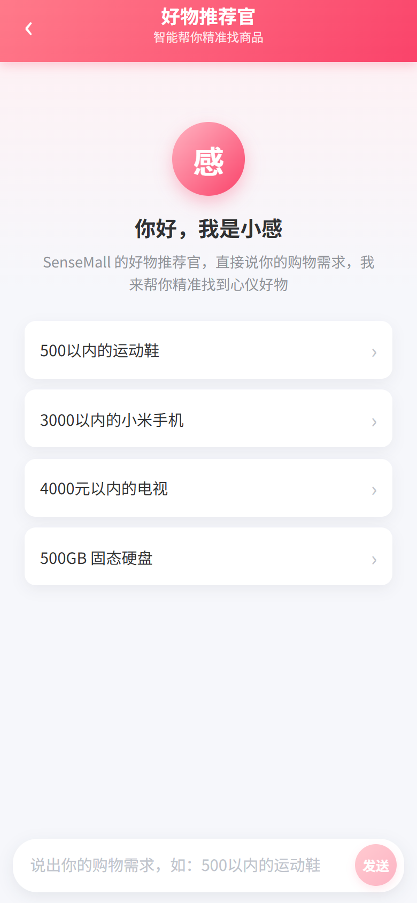
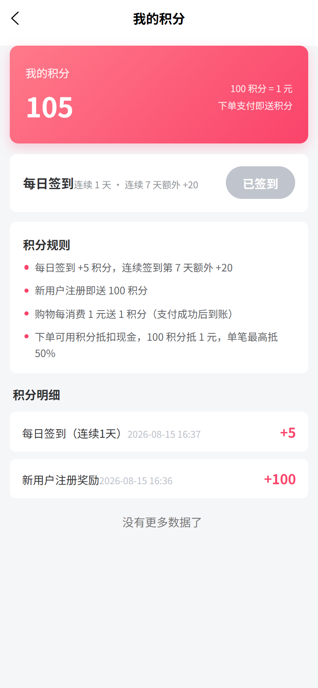
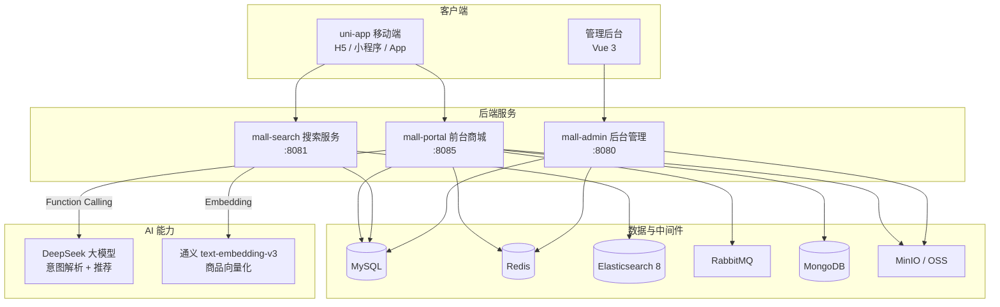
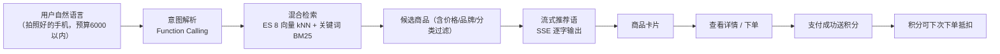

# SenseMall 商城

> 基于开源项目 [mall](https://github.com/macrozheng/mall) 二次开发的 **AI 智能电商平台**。

SenseMall 在前台商城与后台管理的基础上，引入了 **AI 好物推荐官「小感」**（DeepSeek + Spring AI）与
**ES 8 语义搜索**（向量检索 + 关键词混合召回），并重构了仿淘宝风格的移动端首页，
补齐了会员积分体系、申请售后、个人资料等会员功能。

## 核心亮点

- **AI 好物推荐官「小感」**：用自然语言描述购物需求（如"拍照好的手机，预算 6000 以内"），
  通过 Function Calling 解析意图、混合检索商品，并以 SSE 流式输出推荐语与商品卡片；
- **ES 8 语义搜索**：商品文本向量化（通义 text-embedding-v3），向量相似度与关键词 BM25
  混合召回，模糊需求也能精准命中（"拍照好的手机"能召回徕卡影像机型）；
- **仿淘宝移动端首页**：金刚区宫格、限时秒杀横幅、品牌专区、猜你喜欢瀑布流；
- **会员积分体系**：注册/每日签到/购物送积分，下单抵扣（100 积分 = 1 元），完整明细台账；
- **完整会员中心**：个人资料编辑、短信验证码修改密码、申请售后、收藏/足迹/关注、优惠券。

## 界面预览

| 首页（仿淘宝） | AI 好物推荐官 | 我的积分 |
| --- | --- | --- |
|  |  |  |

## 功能总览

### 前台商城（mall-app-web + mall-portal）

- 首页：轮播、金刚区、限时秒杀、品牌专区、新鲜好物、人气推荐、猜你喜欢（瀑布流 + 无限加载）
- 商品：分类浏览、关键词搜索、语义搜索、商品详情、SKU 规格选择
- 交易：购物车、下单确认（优惠券 + 积分抵扣）、订单管理、申请售后
- 会员：注册登录、个人资料、修改密码、收货地址、收藏/关注/足迹、优惠券、积分签到
- AI：好物推荐官「小感」多轮对话、流式推荐

### 后台管理（mall-admin-web + mall-admin）

- 商品管理、订单管理、促销管理（优惠券/限时购/首页广告）、内容管理、会员管理、权限管理（RBAC）

## 技术栈

| 分类 | 技术 |
| --- | --- |
| 后端 | Spring Boot 3.5、JDK 17、MyBatis、PageHelper、Druid |
| AI | Spring AI 1.1.8、DeepSeek（deepseek-v4-flash）、通义 text-embedding-v3 |
| 搜索 | Elasticsearch 8.17、IK 中文分词、dense_vector 向量检索 |
| 中间件 | Redis、RabbitMQ、MongoDB、MinIO/OSS |
| 前端 | uni-app（Vue 3 + TypeScript）、Vue 3 + Vite（后台） |

## 系统架构



## AI 导购流程



## 核心机制

### AI 导购（两阶段 + SSE 流式）

- **意图解析**：Spring AI Function Calling，模型调用 `searchProducts` 工具，品牌/分类按名称在服务端解析为 ID；
- **混合检索**：ES 8 向量 kNN（topK = 3 × pageSize，numCandidates 200）+ 关键词 BM25
  （name^10 / subTitle^5 / keywords^2），语义优先交错合并去重，支持品牌/分类/价格过滤；
- **流式协议**：SSE 事件序列 `session → delta×N → products → done`，异常发送 `error`；
  mall-search 不可用时自动回退数据库检索，保证可用性；
- **会话**：Redis 保存最近 12 条消息，24 小时有效（控制成本）。

### 积分体系

- **获取**：注册 +100、每日签到 +5（连续 7 天额外 +20）、购物每 1 元送 1 积分（支付成功才入账）；
- **消费**：下单抵扣 100 积分 = 1 元，单笔最高 50%，可与优惠券叠加
  （规则存于 `ums_integration_consume_setting`，可配置）；
- **台账**：每次增减写入 `ums_integration_change_history`（来源/数量/余额/关联订单），前端可查明细；
- **防刷与一致性**：签到用 Redis 按"会员 + 日期"防重；送积分只在支付成功触发（订单状态幂等）；
  订单取消/超时自动退回积分。

### 可靠性设计

- LLM 工具参数容错：价格 `0` 视为无限制，参数解析失败自动重试一次；
- 前端 SSE 兜底：XHR 超时 + promise 强制落定，避免流中断导致界面卡死。

## 接口概览

| 接口 | 说明 |
| --- | --- |
| `POST /ai/chat` | AI 导购对话（非流式） |
| `POST /ai/chat/stream` | AI 导购流式对话（SSE） |
| `GET /esProduct/search/semantic` | 语义搜索（向量 + 关键词混合检索） |
| `POST /member/integration/checkin` | 每日签到 |
| `GET /member/integration/history` | 积分明细 |
| `POST /sso/updateProfile` | 更新个人资料 |
| `POST /returnApply/create` | 申请售后 |

## 端口与容器

| 服务 | 端口 |
| --- | --- |
| mall-admin / mall-search / mall-portal | 8080 / 8081 / 8085 |
| mall-app-web（H5 dev） | 5176 |
| Elasticsearch 8 | 9200 |
| MySQL / Redis / MongoDB / RabbitMQ / MinIO | 3305 / 6379 / 27017 / 5672 / 9000 |

## 项目结构

```
SenseMall
├── mall-common      # 通用工具与统一返回/异常
├── mall-mbg         # MyBatis Generator 数据层
├── mall-security     # Spring Security + JWT 封装
├── mall-admin        # 后台管理接口（商品/订单/促销/权限）
├── mall-portal       # 前台商城接口（含 AI 导购与积分）
├── mall-search       # 搜索服务（ES 8 语义检索）
├── mall-demo         # 示例代码
├── mall-admin-web    # 管理后台前端（Vue 3 + Element Plus）
├── mall-app-web      # 移动端商城（uni-app）
└── document          # 文档与开发记录
```

## 快速开始

### 环境依赖

- JDK 17、Maven 3.6+、Node.js 18+（管理后台前端需 Node 20+）
- Docker（MySQL / Redis / MongoDB / RabbitMQ / MinIO）
- Elasticsearch 8.17（本地开发可原生运行，见 `document/ai-assistant/DEVELOPMENT_NOTES.md`）

### 启动

```powershell
# 1. 启动依赖容器 + 三个后端服务（admin/portal/search）
.\start-mall.ps1

# 2. 启动移动端前端
cd mall-app-web
npm install
npm run dev:h5

# 3. 浏览器访问
#    http://localhost:5176
```

### 环境变量

| 变量 | 说明 |
| --- | --- |
| `DEEPSEEK_API_KEY` | DeepSeek 大模型密钥（AI 导购） |
| `DASHSCOPE_API_KEY` | 通义千问密钥（商品向量化） |

## Roadmap

- 会员等级体系（按积分升级，`member_level_id` 字段已预留）
- 商品评价（表与接口待建）
- 消息中心（后端模块待建）
- 检索精排（Rerank）与查询改写
- 积分兑换优惠券

## License

[Apache License 2.0](LICENSE)
